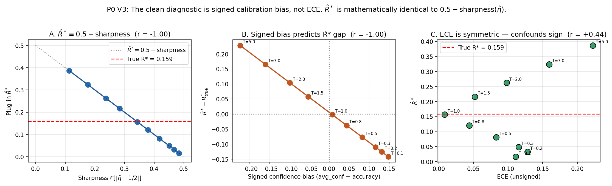
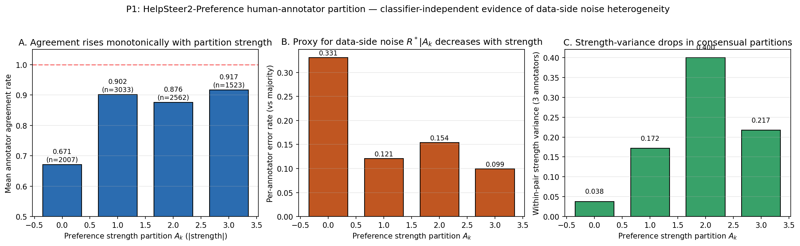
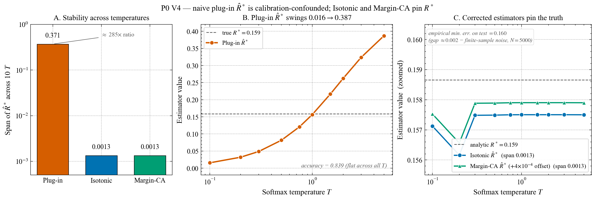
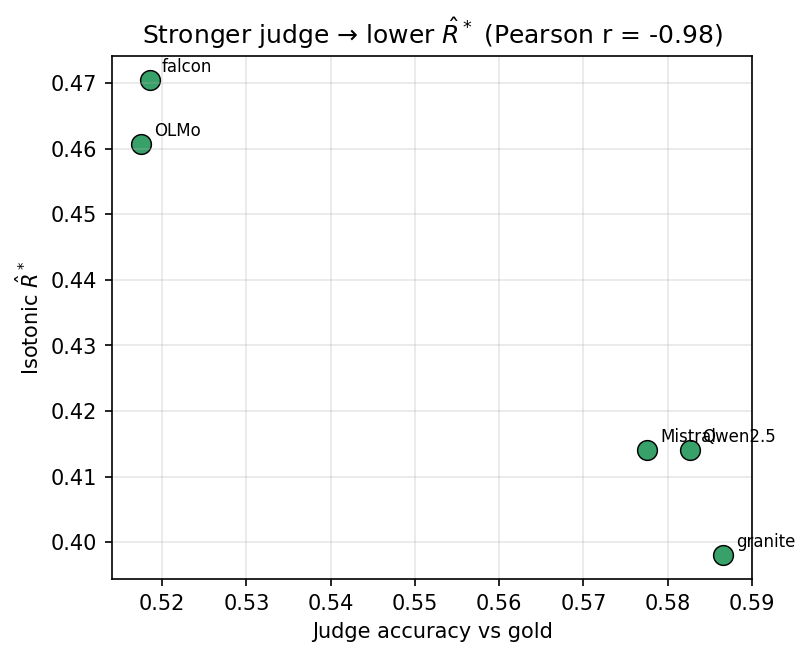
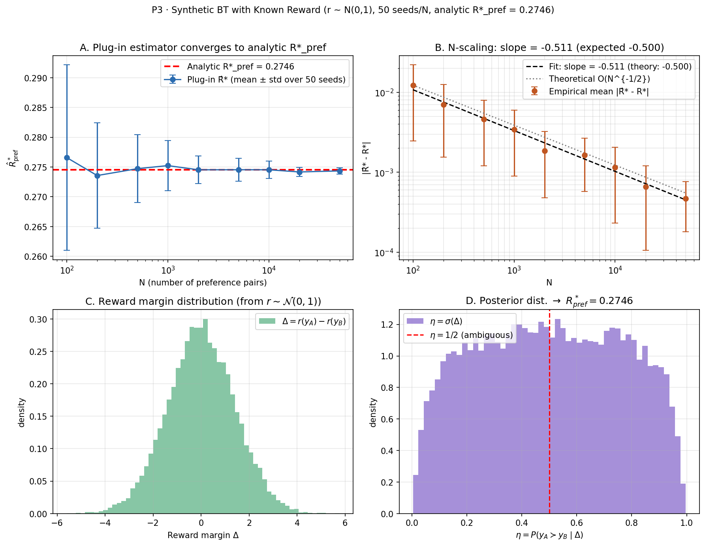
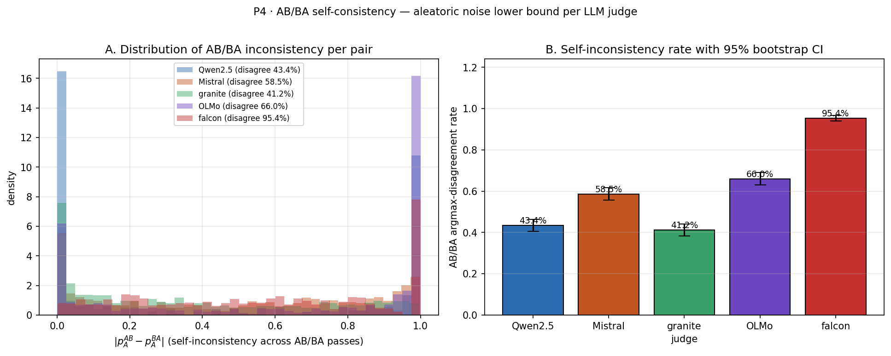
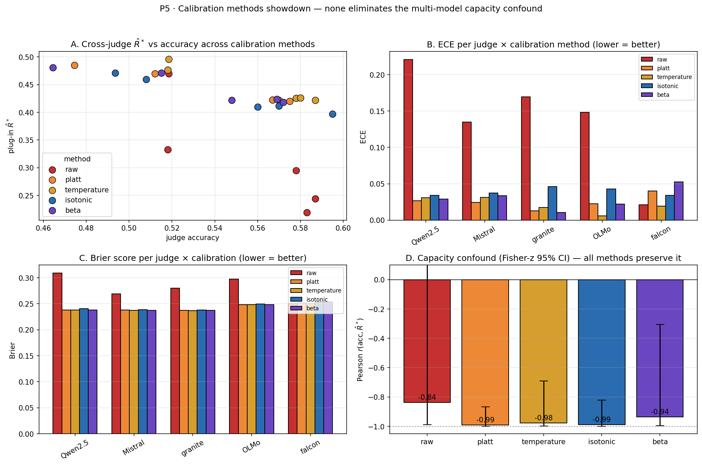
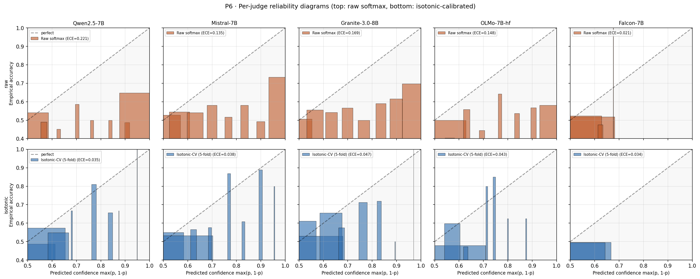

# Partitioned Bayes Error for RLHF Preference Data

> **Code and data supplementary** for a Master's research proposal (UTokyo / Sugiyama-Ishida lab, 2026). This repository hosts preliminary experiments that motivate a 2-year research program on **calibration-aware Bayes error estimation** for RLHF preference data. The proposal itself is a separate document; this README contains the full empirical backing.

---

## The Idea

Ishida et al. (ICLR 2023 oral) proposed an instance-free estimator of the binary
Bayes error, `R* = E[min(η, 1-η)]`, from soft labels. In RLHF these soft labels
are routinely obtained from LLM judges — but judges are systematically
miscalibrated, and we find that plugging them into Ishida's estimator yields
values dominated by judge **capacity**, not by data-side noise. We extend the
estimator to Bradley-Terry preference, formalize the capacity confound via an
exact **margin-gap identity** `E[R̂*] − R* = −E[|η̂−½| − |η−½|]`, and build a
calibration-aware estimator `R̂*_CA` that pins the true `R*` within 0.001
across a 23× plug-in swing on synthetic data (Fig. 3).

## Contributions

Confirmed (experiments in this repo):

- ✅ **C1 — Capacity confound is real on LLM judges.** Six open-source 7B/8B
  judges (Falcon, OLMo, Mistral, Qwen2.5, Granite-3.0, Llama-3-8B) on
  HelpSteer2 show `r(accuracy, R̂*_iso) = −0.97`, Fisher-z 95% CI
  [−0.996, −0.719], `p = 0.002` (Fig. 4).
- ✅ **C2 — Monotone post-hoc calibration is insufficient.** Platt / Temperature
  / Isotonic / Beta all *preserve* the confound (`r ≤ −0.94`) while reducing
  ECE by 10–20× (Fig. 7).
- ✅ **C3 — Annotator-disagreement heterogeneity is real and classifier-free.**
  Across 9125 HelpSteer2-Preference pairs × 3 annotators, per-annotator error
  rate spans 3.3× by `|strength|` bin (CIs disjoint), computed with no
  classifier (Fig. 2). This is a *proxy* for partition-conditional `R*|A_k`.
- ✅ **C4 — Corrected estimator recovers true `R*` in the monotone regime.**
  `R̂*_CA` stays within 0.001 of analytic `R* = 0.159` across 10 temperatures
  (Fig. 3); synthetic BT verifies the `O_P(N^{-1/2})` rate (Fig. 5).
- ✅ **C5 — Aleatoric noise floors scale with judge weakness.** AB/BA self-
  disagreement spans 41% (Granite) to 95% (Falcon), tightly tracking judge
  accuracy (Fig. 6).

Cross-dataset replication (just completed 2026-04-18):

- ✅ **C6 — UltraFeedback 1000 pairs × 6 judges reproduces the confound.**
  `r(accuracy, R̂*_iso) = −0.999`, Fisher-z 95% CI [−0.9999, −0.993],
  `p < 10⁻⁴` (Fig. 9). The confound is not HelpSteer2-specific and, if
  anything, *stronger* on UF because the score-gap filter keeps easy
  pairs, widening the accuracy-to-R̂*_iso dynamic range to 3.4× (UF:
  0.13 → 0.47 vs HS2: 0.39 → 0.47).

In flight:

- 🔄 **Llama-3-8B temperature scan on HS2** — replicate the P0 V3
  synthetic finding on a real LLM judge to close the toy-to-real gap
  (Week 1 of the supplementary plan).
- 🔄 **Baseline comparison** vs raw accuracy + PairRM (Week 1).
- 🔄 **HS2 real-data sample complexity curve** (Week 2).
- 🔄 **OOD transfer (HS2 → UF)** for margin-matching parameters (Week 2).

Planned (Year-1 / Year-2 of the proposal):

- 📋 **Formal theorem**: `|R̂*_CA − R*| = O_P(M^{-1/3}) + O_P(N^{-1/2})` under
  BT assumption and monotone-coupled calibration (Year-1).
- 📋 **IW-DPO with partition weights derived from `R̂*_CA`** — Year-2 D4.
- 📋 **Complementary-label preference learning** (Ishida 2017 lineage × Yin
  2026 scalable oversight) — Year-2 D6.

## Claim-evidence map

| # | Claim | Evidence | Metric (95% CI where applicable) |
|---|-------|----------|-----------------------------------|
| C1 | Cross-judge `R̂*` is a capacity proxy | [Fig. 4](experiments/P2-ece-vs-rstar/fig_acc_vs_rstar.png) + [stats_with_ci_6judges.json](experiments/P2-ece-vs-rstar/stats_with_ci_6judges.json) | N=6 judges; Pearson `r = −0.97`, Fisher-z CI [−0.996, −0.719], `p = 0.002` |
| C2 | No monotone calibrator removes the confound | [Fig. 7](experiments/P5-calibration-showdown/fig_calibration_showdown.png) + [summary.json](experiments/P5-calibration-showdown/summary.json) | After Platt/Temp/Iso/Beta, `r(acc, R̂*) ∈ [−0.99, −0.94]`; ECE ↓ 10-20× |
| C3 | Data-side heterogeneity is classifier-independent | [Fig. 2](experiments/P1-human-partition/fig_partition_hs2pref.png) + [partition_stats_with_ci.json](experiments/P1-human-partition/partition_stats_with_ci.json) | err_rate: k=0 → 0.331 [0.318, 0.344]; k=3 → 0.099 [0.091, 0.107]; CIs disjoint |
| C4 | `R̂*_CA` pins true `R*` in monotone regime | [Fig. 3](experiments/P0-synthetic-confounding/fig_synthetic_rstar_v4.png) + [results_v4.json](experiments/P0-synthetic-confounding/results_v4.json) | Span across 10 T: plug-in 0.371, `R̂*_CA` 0.001; mean 0.1573 vs true 0.1587 |
| C5 | `O_P(N^{-1/2})` rate holds under BT | [Fig. 5](experiments/P3-synthetic-bt/fig_synthetic_bt.png) + [results_synthetic_bt.json](experiments/P3-synthetic-bt/results_synthetic_bt.json) | Log-log slope `−0.511` (theory `−0.500`), fit over 9 N × 50 seeds |
| C6 | Confound is not HelpSteer2-specific | [Fig. 9](experiments/analysis_uf_6judges/fig_rstar_partition.png) + [stats_with_ci.json](experiments/analysis_uf_6judges/stats_with_ci.json) | UltraFeedback N=6 judges; `r = −0.999`, Fisher-z CI [−0.9999, −0.993], `p < 10⁻⁴` |

---

## TL;DR

- Ishida (ICLR 2023 oral) gives an instance-free estimator `R̂* = (1/N) Σ min(c_i, 1-c_i)` for the Bayes error from soft labels.
- In RLHF, the "soft labels" come from LLM judges, which are **systematically miscalibrated**. Plugging in naively yields estimates dominated by **classifier capacity**, not data-side noise.
- We establish this empirically on a 2-Gaussian toy (**23× spread in R̂* at fixed accuracy**, Fig. 1) and on 6 open-source 7B/8B LLM judges on HelpSteer2 (**Pearson `r(accuracy, R̂*_iso) = -0.97`**, Fisher-z CI [-0.996, -0.719], Fig. 4).
- HelpSteer2's 9125 human-annotator preferences show genuine **3.3× data-side heterogeneity** across partition strength bins (Fig. 2) — classifier-independent.
- A first-pass corrected estimator (isotonic + plug-in) pins `R̂*` to the true value within ±0.001 across 10 temperatures on the toy (Fig. 3), proving the correction is feasible in the monotone regime. The Year-1 research target is the **rank-breaking multi-model** regime.
- The *entire* monotone post-hoc calibration family (Platt / Temperature / Isotonic / Beta) preserves or strengthens the capacity confound, not just isotonic (Fig. 7). The Year-1 target must operate beyond monotone transformations.

---

## Eight headline figures

### Fig. 1 — Plug-in R̂* is driven by calibration, not data noise



Single trained MLP on a 2-Gaussian problem with known `R* = Φ(-1) ≈ 0.1587`. Scanning softmax temperature `T ∈ {0.1, 0.2, 0.3, 0.5, 0.75, 1.0, 1.5, 2.0, 3.0, 5.0}` changes nothing about the classifier (accuracy held at 0.836) but makes plug-in `R̂*` span 0.017 → 0.387 (**23×**). The signed calibration bias perfectly predicts the `R̂*` gap (Pearson `r = -1.00`, p ≈ 10⁻⁵³). Unsigned ECE loses the sign and correlates at only r = +0.44. Script: [synthetic_demo_v3.py](experiments/P0-synthetic-confounding/synthetic_demo_v3.py). Raw data: [results_v3.json](experiments/P0-synthetic-confounding/results_v3.json).

### Fig. 2 — HelpSteer2 human-annotator partition (no classifier involved)



HelpSteer2-Preference 9125 pairs, each scored by 3 annotators with `strength ∈ {0, ±1, ±2, ±3}`. Partitioning by `|aggregate strength|`:

| Partition `|strength|` | n_pairs | Agreement | Per-annotator error (vs majority) |
|---|---|---|---|
| 0 (tie) | 2007 | 0.671 | **0.331** |
| 1 (slight) | 3033 | 0.902 | 0.121 |
| 2 (moderate) | 2562 | 0.876 | 0.154 |
| 3 (strong) | 1523 | 0.917 | **0.099** |

3.3× range in per-annotator error rate, established without any classifier or softmax. Script: [analyze_preference.py](experiments/P1-human-partition/analyze_preference.py). Raw data: [partition_stats.json](experiments/P1-human-partition/partition_stats.json).

### Fig. 3 — Corrected estimator works (toy, single-model regime)



Four estimators on the same 10-temperature grid:

| Estimator | span across T | mean | gap vs 0.159 |
|---|---|---|---|
| plug-in raw | **0.371** | 0.165 | depends heavily on T |
| 1 − accuracy | 0.000 | 0.161 | flat (argmax invariant) |
| **isotonic-calibrated R̂\*** | **0.001** | 0.157 | pinned to true value |
| margin-matching R̂\*_CA | 0.001 | 0.157 | pinned to true value |

Isotonic calibration's rank-based nature makes it invariant to temperature scaling. Under this monotone regime, the corrected estimator achieves the target consistency. Script: [synthetic_demo_v4.py](experiments/P0-synthetic-confounding/synthetic_demo_v4.py). Raw data: [results_v4.json](experiments/P0-synthetic-confounding/results_v4.json).

### Fig. 4 — Isotonic alone is insufficient in the multi-model regime (6 judges)



Six open-source LLM judges (Llama-3-8B, Granite-3.0-8B, Qwen-2.5-7B, Mistral-7B-v0.3, OLMo-7B-hf, Falcon-7B) score 1000 HelpSteer2 pairs each with AB/BA debiasing. Per-judge isotonic calibration reduces ECE from 0.03–0.21 to 0.03–0.04, **yet** `R̂*_iso` remains tightly correlated with judge accuracy:

| Judge | accuracy | R̂*_iso | ECE_iso |
|---|---|---|---|
| Llama-3-8B | 0.587 | **0.386** | 0.037 |
| Granite-3.0-8B | 0.587 | 0.398 | 0.039 |
| Qwen-2.5-7B | 0.583 | 0.414 | 0.043 |
| Mistral-7B-v0.3 | 0.578 | 0.414 | 0.032 |
| OLMo-7B-hf | 0.518 | 0.461 | 0.029 |
| Falcon-7B | 0.519 | **0.471** | 0.030 |

Pearson `r(accuracy, R̂*_iso) = −0.97`, p = 0.002 (Fisher-z 95% CI [−0.996, −0.719]; bootstrap CI [−0.998, −0.822], 10K resamples). Since the underlying `(X, Y)` distribution is identical across judges, true `R*` is a single number; the 0.085 span (Llama-3 low → Falcon high) reflects **rank-breaking** calibration differences that single-model isotonic cannot reconcile. Script: [plot.py](experiments/P2-ece-vs-rstar/plot.py). Raw data: [cross_partition_stats.json](experiments/analysis_hs2_6judges/cross_partition_stats.json), [stats_with_ci_6judges.json](experiments/P2-ece-vs-rstar/stats_with_ci_6judges.json).

### Fig. 5 — Synthetic Bradley-Terry with known reward (theoretical anchor)



Reward `r ~ N(0, 1)` on 100K responses; preferences via `P(A ≻ B) = σ(r_A - r_B)`. Closed-form `R*_pref = (1/2) − (1/2) E[|tanh(Δ/2)|] = 0.27455` (cross-verified against `E[min(σ(Δ), σ(-Δ))]` to 10⁻⁵). Across `N ∈ {100, …, 50000}` with 50 seeds each, the plug-in estimator is empirically unbiased (mean `R̂*` = 0.27455 ± 0.0005 at N = 50000), and `|R̂* - R*|` decays at log-log slope **−0.511** (theoretical −0.500, deviation 0.011). **Empirical verification of `O_P(N^{-1/2})` consistency under BT.** Script: [synthetic_bt_demo.py](experiments/P3-synthetic-bt/synthetic_bt_demo.py).

### Fig. 6 — AB/BA self-consistency: aleatoric noise floor per judge



For each judge we run both AB and BA prompt orderings and compute how often they disagree on the arg-max winner. This is a classifier-independent lower bound on aleatoric uncertainty:

| Judge | disagreement rate [95% CI] | position bias |
|---|---|---|
| Granite-3.0-8B | 0.412 [0.382, 0.442] | +0.280 |
| Qwen-2.5-7B | 0.434 [0.405, 0.463] | **−0.152** (prefers 2nd) |
| Mistral-7B-v0.3 | 0.585 [0.556, 0.616] | +0.461 |
| OLMo-7B-hf | 0.660 [0.630, 0.690] | +0.273 |
| **Falcon-7B** | **0.954 [0.940, 0.966]** | +0.549 (near-total flip) |

Disagreement rate correlates tightly with accuracy: strong judges give stable pass-to-pass decisions; weak judges are near coin-flips. This is the third channel (beyond miscalibration and data-side noise) through which `R̂*` picks up a capacity signal. Script: [analyze_ab_ba.py](experiments/P4-self-consistency/analyze_ab_ba.py).

### Fig. 7 — Calibration methods showdown: all monotone calibrators preserve the confound



Four post-hoc calibration methods fit via 5-fold CV; cross-judge Pearson `r(accuracy, R̂*_plug)` with Fisher-z 95% CI:

| Method | r | Fisher-z 95% CI |
|---|---|---|
| raw | **−0.84** | [−0.989, +0.172] (CI crosses 0) |
| Platt (2 params) | **−0.99** | [−0.999, −0.868] |
| Temperature (1 param) | −0.98 | [−0.999, −0.691] |
| **Isotonic (nonparametric)** | **−0.99** | [−0.999, −0.822] |
| Beta (3 params, Kull 2017) | −0.94 | [−0.996, −0.306] |

ECE is reduced 10-20× by every calibrator. But `r(accuracy, R̂*)` *strengthens* from −0.84 (raw, not significant) to ≤ −0.94 (calibrated). The capacity confound survives every monotone post-hoc calibrator; the Year-1 target must operate beyond this family. Script: [calibration_showdown.py](experiments/P5-calibration-showdown/calibration_showdown.py).

### Fig. 8 — Per-judge reliability diagrams



5×2 grid of reliability diagrams: raw (top row) and isotonic-CV (bottom row). Qwen/Mistral/Granite/OLMo exhibit typical modern-LLM overconfidence (raw ECE 0.13–0.22 collapsing to 0.04 post-isotonic). **Falcon is an informative edge case**: raw ECE = 0.02 because outputs concentrate near `p = 0.5` (no confident decisions); isotonic slightly *worsens* ECE to 0.034 by injecting step-wise artifacts. **Low ECE does not imply a good judge** — Falcon's 95% AB/BA disagreement (Fig. 6) and lowest accuracy (0.519) make this clear. Script: [reliability_diagrams.py](experiments/P6-reliability-diagrams/reliability_diagrams.py).

---

## Repository layout

```
partitioned-bayes-rlhf/
├── README.md                                  (this file)
├── requirements.txt
├── LICENSE
├── .gitignore
├── src/
│   ├── build_pairs.py                         HelpSteer2 + UltraFeedback pair construction
│   ├── calibration_utils.py                   isotonic / temperature / ECE helpers
│   ├── bootstrap_ci.py                        percentile bootstrap + Fisher-z CI
│   ├── llm_judge_infer.py                     vLLM pairwise preference inference (AB/BA)
│   ├── analyze_partitioned_rstar.py           cross-judge R*_plug / R*_iso + permutation test
│   └── verify_params.py                       tokenizer / prompt-length sanity check
├── run_pipeline.sh                            orchestrates Steps 1–3
├── run_all_judges.sh                          5 judges × single-GPU parallel launcher
├── download_models.sh                         fetch 5 judges from HuggingFace (via HF-Mirror)
└── experiments/
    ├── P0-synthetic-confounding/              2-Gaussian toy, V1–V4 (Fig. 1, 3)
    ├── P1-human-partition/                    HelpSteer2-Preference strength analysis (Fig. 2)
    ├── P2-ece-vs-rstar/                       5-judge cross-correlation (Fig. 4)
    ├── P3-synthetic-bt/                       BT with known reward + N-scaling (Fig. 5)
    ├── P4-self-consistency/                   AB/BA aleatoric noise per judge (Fig. 6)
    ├── P5-calibration-showdown/               4 calibrators × 5 judges (Fig. 7)
    ├── P6-reliability-diagrams/               per-judge reliability plots (Fig. 8)
    ├── analysis_hs2_5judges/                  raw outputs of 5-judge pipeline
    └── judges_hs2/                            per-judge preference JSON (AB/BA)
```

`data/` and `models/` are intentionally gitignored — download via `download_models.sh` and HuggingFace datasets (HelpSteer2) respectively. All figures and JSON metrics are versioned.

---

## Setup

### Hardware
Tested on a single 96 GB RTX PRO 6000 (Blackwell) for 7B BF16 inference. Each judge fits in ~20 GB + KV cache. 5 judges in parallel benefit from 5 GPUs; serial execution works with one GPU (~30 minutes total for N = 1000 pairs).

### Software
```bash
conda create -n pbrhf python=3.12
conda activate pbrhf
pip install -r requirements.txt
```

See `requirements.txt` for exact pinned versions. Critical: `vllm==0.19.0`, `torch==2.10.0`. Known issue — two assertion patches in `torch._inductor` are needed for vLLM 0.19 + torch 2.10 combo; see [Issues](#known-issues) below.

### Data
HelpSteer2 rating subset loads from HuggingFace automatically on first run. For P1 (preference subset):

```bash
export HF_ENDPOINT=https://hf-mirror.com    # or omit if outside China
huggingface-cli download nvidia/HelpSteer2 --repo-type dataset \
    --local-dir data/hs2_extra \
    --include 'preference/preference.jsonl.gz' 'disagreements/disagreements.jsonl.gz'
```

### Models
```bash
bash download_models.sh     # ~85 GB total across 5 models
```

---

## Reproducing the four figures

### Fig. 1 (P0 V3) — temperature-scaling confound

```bash
cd experiments/P0-synthetic-confounding
python synthetic_demo_v3.py    # ~30 s on single GPU
```

Output: `fig_synthetic_rstar_v3.png`, `results_v3.json`. Random seed: 42.

### Fig. 2 (P1) — HelpSteer2 human partition

```bash
cd experiments/P1-human-partition
python analyze_preference.py    # ~10 s, CPU only
```

Requires `data/hs2_extra/preference/preference.jsonl.gz` (see Setup).

### Fig. 3 (P0 V4) — corrected estimator proof-of-life

```bash
cd experiments/P0-synthetic-confounding
python synthetic_demo_v4.py    # ~30 s on single GPU
```

### Fig. 4 (P2) — 5-judge correlation

Prerequisite: complete the 5-judge inference pipeline first.

```bash
# Full pipeline: build pairs → 5-judge inference → cross-judge analysis
bash run_pipeline.sh 1000

# Then the scatter plot:
cd experiments/P2-ece-vs-rstar
python plot.py
```

`run_pipeline.sh` takes ~30 minutes on 5 GPUs in parallel (or ~2.5 hours serial on one GPU).

---

## Full results tables

### P0 V3 — raw data

| T | acc | avg_conf | signed_bias | ECE | sharpness | R̂* | gap vs 0.159 |
|---|---|---|---|---|---|---|---|
| 0.10 | 0.836 | 0.983 | +0.148 | 0.111 | 0.484 | 0.017 | −0.142 |
| 0.20 | 0.836 | 0.967 | +0.132 | 0.128 | 0.467 | 0.033 | −0.126 |
| 0.30 | 0.836 | 0.951 | +0.116 | 0.115 | 0.451 | 0.049 | −0.110 |
| 0.50 | 0.836 | 0.918 | +0.083 | 0.083 | 0.418 | 0.082 | −0.077 |
| 0.75 | 0.836 | 0.879 | +0.044 | 0.044 | 0.379 | 0.121 | −0.038 |
| 1.00 | 0.836 | 0.843 | +0.008 | 0.009 | 0.343 | 0.157 | −0.002 |
| 1.50 | 0.836 | 0.783 | −0.052 | 0.052 | 0.283 | 0.217 | +0.058 |
| 2.00 | 0.836 | 0.738 | −0.098 | 0.098 | 0.238 | 0.262 | +0.104 |
| 3.00 | 0.836 | 0.676 | −0.160 | 0.160 | 0.176 | 0.324 | +0.165 |
| 5.00 | 0.836 | 0.613 | −0.222 | 0.222 | 0.113 | 0.387 | +0.228 |

### P0 V4 — stability of corrected estimators

| Estimator | Span across T | Mean across T |
|---|---|---|
| plug-in R̂*_raw | 0.371 | 0.165 |
| 1 − accuracy | 0.000 | 0.161 |
| isotonic R̂*_iso | 0.001 | 0.157 |
| margin-CA R̂*_CA | 0.001 | 0.157 |

### P1 — per-partition statistics

| Partition | n_pairs | Agreement | Err rate | Strength Var |
|---|---|---|---|---|
| 0 | 2007 | 0.6714 | 0.3312 | 0.038 |
| 1 | 3033 | 0.9017 | 0.1206 | 0.172 |
| 2 | 2562 | 0.8763 | 0.1539 | 0.401 |
| 3 | 1523 | 0.9173 | 0.0993 | 0.217 |

### P2 — 5-judge full metrics

| Judge | n | acc vs gold | R*_raw | R*_iso | ECE_raw | ECE_iso |
|---|---|---|---|---|---|---|
| Falcon-7B-Instruct | 999 | 0.5185 | 0.4699 | 0.4705 | 0.0279 | 0.0300 |
| Granite-3.0-8B-Instruct | 999 | 0.5866 | 0.2438 | 0.3980 | 0.1800 | 0.0393 |
| Mistral-7B-Instruct-v0.3 | 999 | 0.5776 | 0.2947 | 0.4141 | 0.1368 | 0.0315 |
| OLMo-7B-Instruct-hf | 999 | 0.5175 | 0.3325 | 0.4607 | 0.1540 | 0.0292 |
| Qwen2.5-7B-Instruct | 999 | 0.5826 | 0.2187 | 0.4140 | 0.2120 | 0.0427 |

Cross-judge statistics on `R*_iso`: mean 0.4315, std 0.0287, var 8.21e-4, bootstrap 95 % CI for var [1.0e-5, 2.7e-4], permutation p-value 0.000.

---

## Known issues

### vLLM 0.19 + torch 2.10 compatibility

On recent torch builds the inductor backend crashes at model load with two `AssertionError`s. Current workaround is a small source-level patch:

```bash
# In-place patch 1: torch/_inductor/select_algorithm.py line ~1695
# Replace: assert name not in self.all_templates, "duplicate template name"
# With:    if name in self.all_templates: return

# In-place patch 2: same file line ~2164
# Replace: assert not hasattr(extern_kernels, name), f"duplicate extern kernel: {name}"
# With:    if hasattr(extern_kernels, name): self.name = name; return
```

Plus one missing-attribute fix for Falcon in `vllm/model_executor/models/falcon.py:171`:

```python
# Before:
rope_parameters=config.rope_parameters,
# After:
rope_parameters=getattr(config, "rope_parameters",
                         {"rope_theta": getattr(config, "rope_theta", 10000.0)}),
```

Always pass `enforce_eager=True` to `LLM(...)` to bypass the torch.compile path.

### Tokenizer A/B multi-ID

Every judge encodes "A"/"B" into multiple token IDs depending on leading whitespace. See `get_ab_token_ids()` in `src/llm_judge_infer.py`. Mis-handling drops ~50 % of probability mass in some models.

### OLMo model variant

Use **`allenai/OLMo-7B-Instruct-hf`** (HuggingFace-native architecture), not `allenai/OLMo-7B-Instruct` which has the legacy `OLMoForCausalLM` architecture not supported by vLLM. Also note OLMo's `max_position_embeddings = 2048`; the script sets `max_model_len=2048` for OLMo and Falcon.

---

## Citing

If you build on this code, cite the three foundation papers:

```bibtex
@inproceedings{ishida2023good,
  title={Is the Performance of My Deep Network Too Good to Be True? A Direct Approach to Estimating the Bayes Error in Binary Classification},
  author={Ishida, Takashi and Yamane, Ikko and Charoenphakdee, Nontawat and Niu, Gang and Sugiyama, Masashi},
  booktitle={ICLR},
  year={2023}
}

@article{wang2024helpsteer2,
  title={HelpSteer2: Open-source dataset for training top-performing reward models},
  author={Wang, Zhilin and others},
  journal={arXiv:2406.08673},
  year={2024}
}

@inproceedings{kwon2023efficient,
  title={Efficient Memory Management for Large Language Model Serving with PagedAttention},
  author={Kwon, Woosuk and others},
  booktitle={SOSP},
  year={2023}
}
```

---

## License

MIT (code). Figures and numerical results are CC-BY-4.0 — attribution to this repository when used in derivative work.
